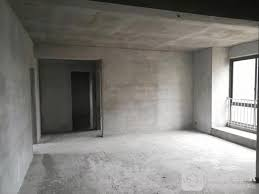
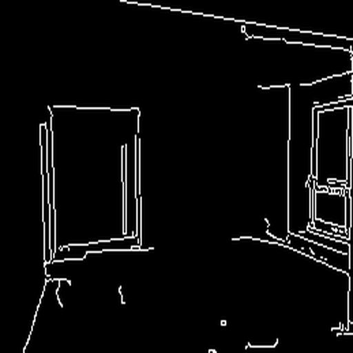
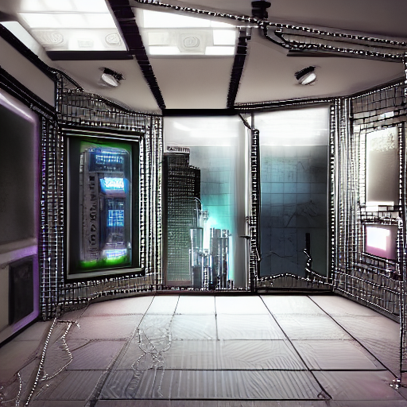
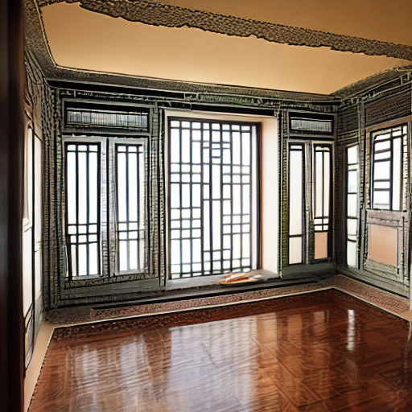
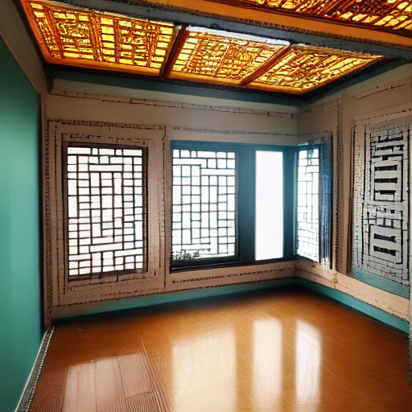

## 第五次作业说明

- **通过这次作业还是学习到了当下最火的prompt学习过程，其实对于图片生成这样的任务还是挺考验我们对提示词的微调技能的**
- **甚至在这次作业中我还发现了一个很有意思的问题：canny阈值的选择对于模型的预测输出也有一定影响，当我们把阈值调低的时候边缘检测会更好，但是图片生成很多时候就有很多缺陷。但如果是阈值很高，那么边缘不是很明显，此时生成的图片虽然看上去效果非常好，却也改变了原来的房屋细节，我们很难说哪种情况是更好的不是吗？这不也是AIGC的其中魅力所在！**
- **此外对于这种AIGC的大模型非常的占用显存，仅仅只是在模型推理的时候对于我使用Tesla T4的显卡，显存占用就高达13GB**

- **文件详细说明**

    - **MMagic_AIGC.ipynb:** 实验代码
    - **house.jpg:** 需要装修的房屋内部图片
    - **canny.png:** 边缘检测的结果
    - **pred1.png:** 第一个prompt生成海报结果
    - **pred2.png:** 第二个prompt生成海报结果
    - **pred3.png:** 第三个prompt生成海报结果

- **实验结果**

    
    
    

    **prompt: 'A cyberpunk room style'**

    

    **prompt: 'Room decorated in European Mediterranean style'**

    

    **prompt: 'A traditional chinese room style and the windows are floor-to-ceiling'**

    