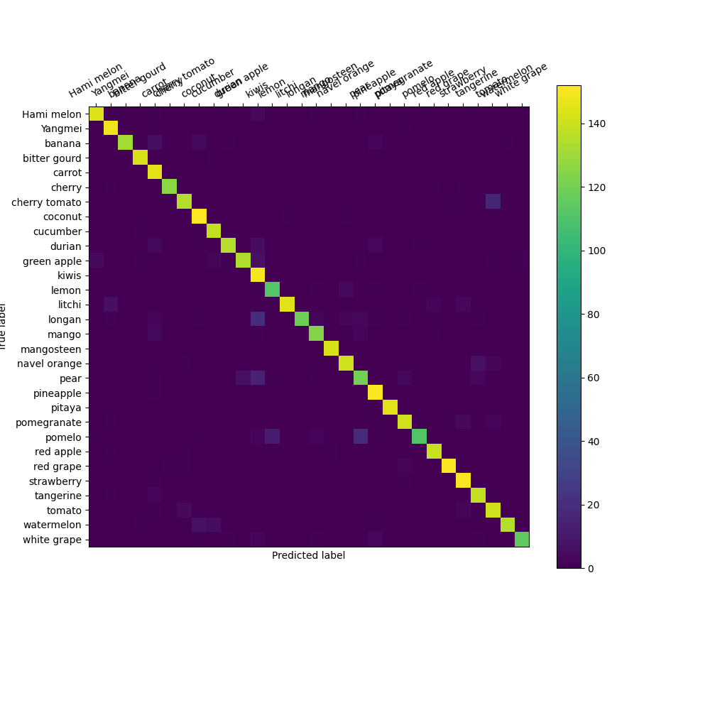

## 第二次作业说明

- **本次作业全程在colab完成，感谢助教提供的drive下载链接，epoch为10，预训练微调即可达到很高精度**


- **文件列表说明**
  - config文件夹下存放了本次实验的配置文件：resnet50_8xb32-fp16_in1k.py
  - train_log：训练日志
  - test_log：测试日志
  - 根目录OpenMMLAB_MMPretrain.ipynb：本次实验的脚本文件
  - label定义：label_name.txt
  - 测试图片：test.jpeg
  - 预测结果：prediction.png
  - 模型分析评估：confuse_matrix.png


- **实验结果**
    
    - 训练日志
    ```shell
    2023/06/07 02:08:53 - mmengine - INFO - Epoch(train)  [9][100/137]  lr: 1.0000e-02  eta: 0:00:30  time: 0.1499  data_time: 0.0239  memory: 1637  loss: 0.5465
    2023/06/07 02:08:58 - mmengine - INFO - Exp name: resnet50_8xb32-fp16_in1k_20230607_020156
    2023/06/07 02:08:58 - mmengine - INFO - Saving checkpoint at 9 epochs
    2023/06/07 02:09:16 - mmengine - INFO - Epoch(val)  [9][100/137]    eta: 0:00:05  time: 0.1296  data_time: 0.0422  memory: 1637  
    2023/06/07 02:09:22 - mmengine - INFO - Epoch(val) [9][137/137]    accuracy/top1: 93.8057  data_time: 0.0739  time: 0.1637
    2023/06/07 02:09:22 - mmengine - INFO - The previous best checkpoint /content/mmpretrain/outputs/best_accuracy_top1_epoch_5.pth is removed
    2023/06/07 02:09:24 - mmengine - INFO - The best checkpoint with 93.8057 accuracy/top1 at 9 epoch is saved to best_accuracy_top1_epoch_9.pth.
    2023/06/07 02:09:43 - mmengine - INFO - Epoch(train) [10][100/137]  lr: 1.0000e-02  eta: 0:00:06  time: 0.1908  data_time: 0.0578  memory: 1637  loss: 0.3976
    2023/06/07 02:09:48 - mmengine - INFO - Exp name: resnet50_8xb32-fp16_in1k_20230607_020156
    2023/06/07 02:09:48 - mmengine - INFO - Saving checkpoint at 10 epochs
    2023/06/07 02:10:05 - mmengine - INFO - Epoch(val) [10][100/137]    eta: 0:00:05  time: 0.1237  data_time: 0.0331  memory: 1637  
    2023/06/07 02:10:11 - mmengine - INFO - Epoch(val) [10][137/137]    accuracy/top1: 92.0457  data_time: 0.0641  time: 0.1541
    ```
    - 测试日志
    ```shell
    2023/06/07 02:12:07 - mmengine - INFO - Load checkpoint from outputs/best_accuracy_top1_epoch_9.pth
    2023/06/07 02:12:25 - mmengine - INFO - Epoch(test) [100/137]    eta: 0:00:06  time: 0.1586  data_time: 0.0754  memory: 435  
    2023/06/07 02:12:30 - mmengine - INFO - Epoch(test) [137/137]    accuracy/top1: 93.8057  data_time: 0.0672  time: 0.1652
    ```

    - 测试图片

    

    - 预测结果

    

    - 混淆矩阵分析

    
  