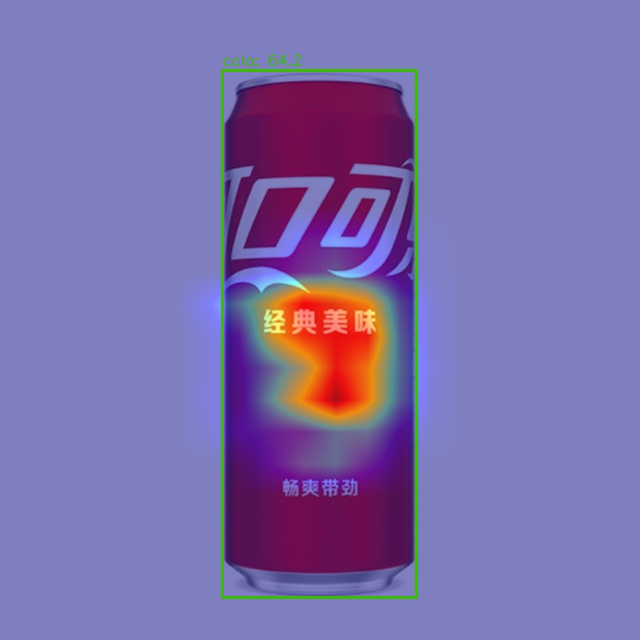

## 第三次作业说明

- **备注：本次作业采用了十类饮料目标检测数据集`Drink_284`而没有采用最原始的单类气球数据集，同时在colab T4 16G环境下训练40个epoch，mAP就已经非常好了**

- **一点思考：不知道是不是因为多分类目标检测的难度问题，虽然是pretrain且map已经非常惊人，但是实际从网图下载的预测置信度方面却不是那么令人满意，怀疑还是跟数据集本身有关，也可能存在一定的过拟合现象**

- **以下是文件详细描述**

    - train_log：存储训练的日志文件
    - test_log：存储测试的日志文件
    - config.py：实验配置文件
    - rtmdet_Drink_284.ipynb：本次实验脚本
    - 测试集预测图.png：测试集上的预测结果显示
    - test.jpg：用于预测的网图
    - res.png：网图预测结果显示
    - backbone_feature.png：backbone特征图显示
    - neck_feature.png：neck特征图显示
    - min_feature.png：最小特征图显示
    - max_feature.png：最大特征图显示


- **以下是实验结果**

    - 训练日志
    ```shell
    2023/06/09 08:37:41 - mmengine - INFO - Epoch(train) [29][ 5/23]  lr: 1.0303e-04  eta: 0:16:21  time: 3.6526  data_time: 3.2216  memory: 1392  loss: 0.4809  loss_cls: 0.3028  loss_bbox: 0.1781
    2023/06/09 08:37:56 - mmengine - INFO - Epoch(train) [29][10/23]  lr: 1.0059e-04  eta: 0:16:02  time: 3.6557  data_time: 3.2201  memory: 1392  loss: 0.4851  loss_cls: 0.3052  loss_bbox: 0.1799
    2023/06/09 08:38:18 - mmengine - INFO - Epoch(train) [29][15/23]  lr: 9.8123e-05  eta: 0:15:45  time: 3.6385  data_time: 3.1966  memory: 1392  loss: 0.4849  loss_cls: 0.3046  loss_bbox: 0.1802
    2023/06/09 08:38:32 - mmengine - INFO - Epoch(train) [29][20/23]  lr: 9.5640e-05  eta: 0:15:25  time: 3.6347  data_time: 3.2035  memory: 1392  loss: 0.4888  loss_cls: 0.3063  loss_bbox: 0.1826
    2023/06/09 08:38:41 - mmengine - INFO - Exp name: rtmdet_tiny_1xb12-40e_drink_20230609_075749
    2023/06/09 08:39:02 - mmengine - INFO - Epoch(train) [30][ 5/23]  lr: 9.1635e-05  eta: 0:14:57  time: 3.5593  data_time: 3.1394  memory: 1392  loss: 0.4973  loss_cls: 0.3126  loss_bbox: 0.1848
    2023/06/09 08:39:17 - mmengine - INFO - Epoch(train) [30][10/23]  lr: 8.9117e-05  eta: 0:14:38  time: 3.5467  data_time: 3.1216  memory: 1392  loss: 0.4951  loss_cls: 0.3112  loss_bbox: 0.1839
    2023/06/09 08:39:37 - mmengine - INFO - Epoch(train) [30][15/23]  lr: 8.6590e-05  eta: 0:14:20  time: 3.5362  data_time: 3.1184  memory: 1392  loss: 0.4906  loss_cls: 0.3083  loss_bbox: 0.1823
    2023/06/09 08:39:53 - mmengine - INFO - Epoch(train) [30][20/23]  lr: 8.4059e-05  eta: 0:14:01  time: 3.5537  data_time: 3.1455  memory: 1392  loss: 0.4959  loss_cls: 0.3128  loss_bbox: 0.1830
    ```

    - 测试日志
    ```shell
    2023/06/09 08:59:42 - mmengine - INFO - Epoch(test) [35/56]    eta: 0:01:43  time: 4.9327  data_time: 4.8589  memory: 193  
    2023/06/09 09:00:05 - mmengine - INFO - Epoch(test) [40/56]    eta: 0:01:17  time: 4.8693  data_time: 4.7989  memory: 193  
    2023/06/09 09:00:28 - mmengine - INFO - Epoch(test) [45/56]    eta: 0:00:53  time: 4.8411  data_time: 4.7714  memory: 193  
    2023/06/09 09:00:54 - mmengine - INFO - Epoch(test) [50/56]    eta: 0:00:29  time: 4.8394  data_time: 4.7719  memory: 193  
    2023/06/09 09:01:19 - mmengine - INFO - Epoch(test) [55/56]    eta: 0:00:04  time: 4.8984  data_time: 4.8449  memory: 193  
    2023/06/09 09:01:26 - mmengine - INFO - Evaluating bbox...
    2023/06/09 09:01:27 - mmengine - INFO - bbox_mAP_copypaste: 0.931 0.993 0.993 -1.000 -1.000 0.931
    2023/06/09 09:01:27 - mmengine - INFO - Epoch(test) [56/56]  coco/bbox_mAP: 0.9310  coco/bbox_mAP_50: 0.9930  coco/bbox_mAP_75: 0.9930  coco/bbox_mAP_s: -1.0000  coco/bbox_mAP_m: -1.0000  coco/bbox_mAP_l: 0.9310  data_time: 4.8518  time: 4.9055
    ```
    - 测试集预测结果
  
    

    - 网络图原图-预测图

    
    

    - 使用mmyolo-backbone特征图

    

    - 使用mmyolo-neck特征图

    

    - 最大特征图Grad CAM

    

    - 最小特征图Grad CAM

    