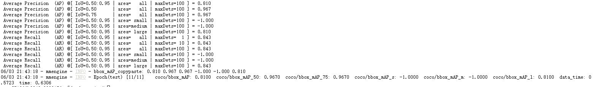
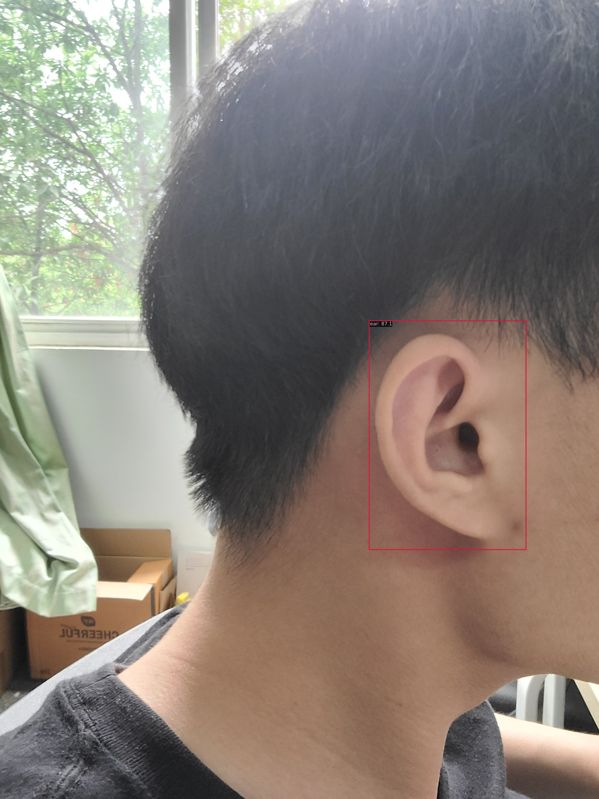
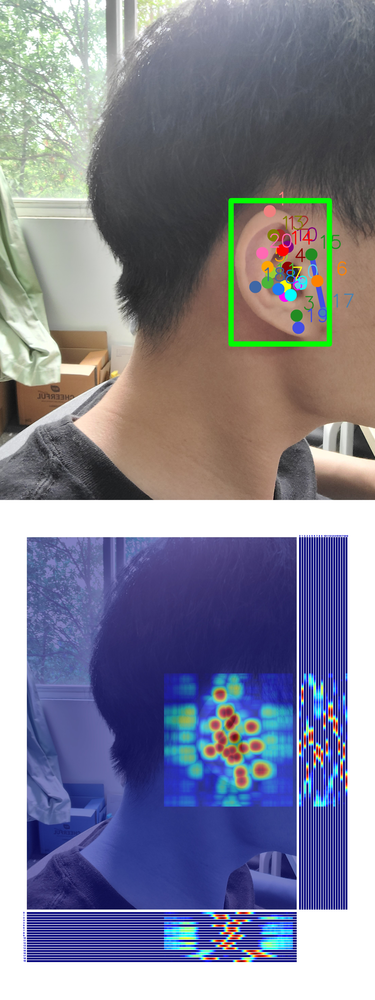

## 第一次作业说明
- 主要包括子豪兄视频中提到的目标检测和关键点检测两个任务代码：实验代码

- 本次作业没怎么调参，主要是改了下epoch，训练时间较长，全程命令行训练无需脚本，只需修改对应的配置文件即可：rtmdet_tiny_ear.py和rtmpose_s_ear.py

- 接下来部分就是两个模型训练和测试时的log文件记录

  - rtmdet_train_20230603_192021.log为目标检测模型训练时的log文件
  - rtmdet_test_20230603_214254.log为目标检测模型测试时的log文件
  - rtmpose_train_20230603_222429.log为关键点检测模型训练时的log文件
  - rtmpose_test_20230604_142716.log为关键点检测模型测试时的log文件

**目标检测模型在测试集上结果如下图所示：**

**单张图片检测结果如下：**

**关键点检测模型在测试集上结果如下图所示**

**单张图片检测结果如下：**

