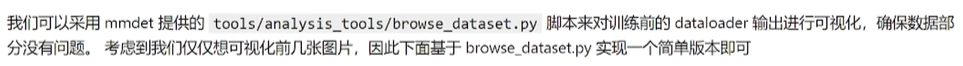
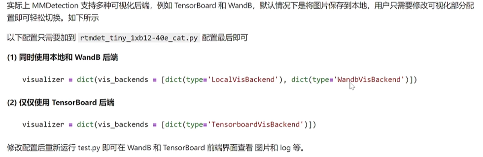
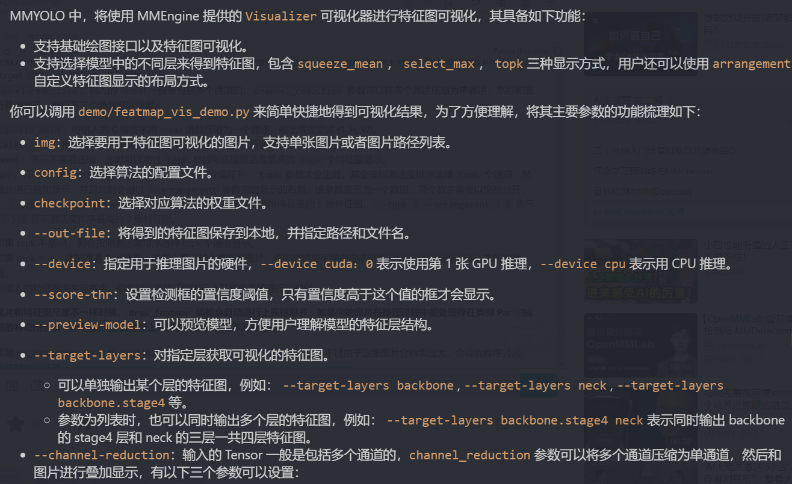

# 第七次课堂笔记-目标检测实战MMDet

- **本次教程全程基于Google Colab，详细notebook如下：https://github.com/open-mmlab/mmdetection/blob/tutorials/demo/MMDet_Tutorial.ipynb**

- **由于训练营视频可能比较久远的录播了，所以现在的tutorial分支已经有些变化，不过不影响我们学习**

- **养成良好的习惯，无论是做什么实验都希望遵循下列步骤（可避免许多错误）**

    - 1、数据集准备和可视化
    - 2、自定义配置文件
    - 3、训练前可视化验证
    - 4、模型训练
    - 5、模型测试和推理
    - 6、可视化分析

- **在目标检测领域，推荐使用coco标注格式，是一种比较统一的标准**

- **关于MMDet中的配置文件可见官方文档：https://mmdetection.readthedocs.io/zh_CN/latest/user_guides/config.html**

    (这部分这个视频感觉讲得有点蛇皮，有地方也对应不上，不知道是视频太老还是文档太老，脑壳疼)

- **写完配置文件不要急着开始训练：先检查数据流有没有问题**

    
    ```python
    from mmdet.registry import DATASETS, VISUALIZERS
    from mmengine.config import Config
    from mmengine.registry import init_default_scope

    cfg = Config.fromfile('rtmdet_tiny_1xb12-40e_cat.py')

    init_default_scope(cfg.get('default_scope', 'mmdet'))

    dataset = DATASETS.build(cfg.train_dataloader.dataset)
    visualizer = VISUALIZERS.build(cfg.visualizer)
    visualizer.dataset_meta = dataset.metainfo

    plt.figure(figsize=(16, 5))

    # 只可视化前 8 张图片
    for i in range(8):
    item=dataset[i]

    img = item['inputs'].permute(1, 2, 0).numpy()
    data_sample = item['data_samples'].numpy()
    gt_instances = data_sample.gt_instances
    img_path = osp.basename(item['data_samples'].img_path)

    gt_bboxes = gt_instances.get('bboxes', None)
    gt_instances.bboxes = gt_bboxes.tensor
    data_sample.gt_instances = gt_instances

    visualizer.add_datasample(
                osp.basename(img_path),
                img,
                data_sample,
                draw_pred=False,
                show=False)
    drawed_image=visualizer.get_image()

    plt.subplot(2, 4, i+1)
    plt.imshow(drawed_image[..., [2, 1, 0]])
    plt.title(f"{osp.basename(img_path)}")
    plt.xticks([])
    plt.yticks([])

    plt.tight_layout()
    ```

- **可视化配置**

    

- **可视化分析模型**

    
    **也可以使用第三方库grad-cam可视化**

- **<font color='red'>目标检测的新趋势！！！</font>**

    随着 ChatGPT 等的 LLM 飞速发展，传统的目标检测也逐渐发展为传统的封闭类别集合检测和自然语言相结合的开放类别检测(当然还有其他非常多结合检测的新方向)。典型的方向如：

  1. **Open-Vocabulary Object Detection**，即开放词汇目标检测，给定图片和类别词汇表，检测所有物体
  2. **Grounding Object Detection**，即给定图片和文本描述，预测文本中所提到的在图片中的物体位置

  大家可以多关注这个新方向和新趋势。该方向的典型算法为 GLIP

  **(1) 图片+ 语言描述：bench.car**

  

  上述输入的是固定类别名，因此等价于 Open-Vocabulary Object Detection。如果将类别名设置为 COCO 全部类别，那么其实就可以转变了常规的目标检测算法。

  **(2) 图片+ 语言描述：There are a lot of cars here.**

  

  上述输入是自然语言描述，因此等价于 Grounding Object Detection

  当然随着 ChatGPT 的强大功能，一个模型可以完成非常多不可思议的事情，在视觉领域大家也开始倾向于研究大一统模型，例如通用图像分割模型，一个模型可以实现封闭集和开放集语义分割、实例分割、全景分割、图像描述等等任务，典型的如 X-Decoder

  
