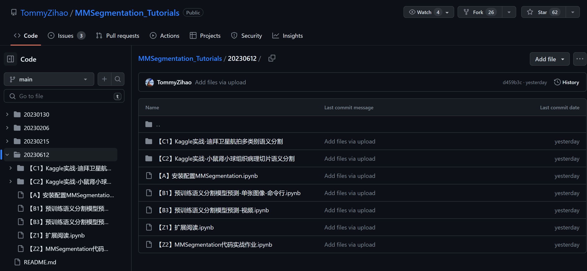

# 第九次课堂笔记-MMSegmentation实战

**代码地址：** https://github.com/TommyZihao/MMSegmentation_Tutorials/tree/main/20230612



**全程使用jupyter-notebook，实际上这堂课没啥干活，主要就是讲下MMSegmentation怎么用**

**使用预训练模型命令行预测**
    
    !python demo/image_demo.py \   # 运行推理文件
            data/street_uk.jpeg \   # 输入图片
            configs/pspnet/ pspnet_r50-d8_4xb2-40k_cityscapes-512x1024.py \      # 配置文件
            https://download.openmmlab.com/mmsegmentation/v0.5/pspnet/pspnet_r50-d8_512x1024_40k_cityscapes/pspnet_r50-d8_512x1024_40k_cityscapes_20200605_003338-2966598c.pth \    # 传入权重文件
            --out-file outputs/B1_uk_pspnet.jpg \   # 指定输出目录
            --device cuda:0 \   # 是否使用GPU
            --opacity 0.5     # 指定不透明度
             
**使用python API自定义可视化效果**    
```python
# 首先载入模型
# 模型 config 配置文件
# config_file = 'configs/pspnet/pspnet_r50-d8_4xb2-40k_cityscapes-512x1024.py'
config_file = 'configs/mask2former/mask2former_swin-l-in22k-384x384-pre_8xb2-90k_cityscapes-512x1024.py'

# 模型 checkpoint 权重文件
# checkpoint_file = 'https://download.openmmlab.com/mmsegmentation/v0.5/pspnet/pspnet_r50-d8_512x1024_40k_cityscapes/pspnet_r50-d8_512x1024_40k_cityscapes_20200605_003338-2966598c.pth'
checkpoint_file = 'https://download.openmmlab.com/mmsegmentation/v0.5/mask2former/mask2former_swin-l-in22k-384x384-pre_8xb2-90k_cityscap'

from mmseg.apis import init_model
model = init_model(config_file, checkpoint_file, device='cuda:0')

from mmseg.apis import inference_model
from mmengine.model.utils import revert_sync_batchnorm
if not torch.cuda.is_available():
    model = revert_sync_batchnorm(model)

result = inference_model(model, img_path)   # 推理结果

class_map = result.pred_sem_seg.data[0].detach().cpu().numpy() # data里面存储的就是每个像素的类别，直接画图的话对应的就是颜色

plt.imshow(class_map)
plt.show()


### 推荐使用下面的可视化方法

from mmseg.datasets import cityscapes
import numpy as np
import mmcv 

# 获取类别名和调色板
classes = cityscapes.CityscapesDataset.METAINFO['classes']
palette = cityscapes.CityscapesDataset.METAINFO['palette']
opacity = 0.15 # 透明度，越大越接近原图

# 将分割图按调色板染色
# seg_map = result[0].astype('uint8')
seg_map = class_map.astype('uint8')
seg_img = Image.fromarray(seg_map).convert('P')
seg_img.putpalette(np.array(palette, dtype=np.uint8))

from matplotlib import pyplot as plt
import matplotlib.patches as mpatches
plt.figure(figsize=(14, 8))
im = plt.imshow(((np.array(seg_img.convert('RGB')))*(1-opacity) + mmcv.imread(img_path)*opacity) / 255)

# 为每一种颜色创建一个图例
patches = [mpatches.Patch(color=np.array(palette[i])/255., label=classes[i]) for i in range(18)]
plt.legend(handles=patches, bbox_to_anchor=(1.05, 1), loc=2, borderaxespad=0., fontsize='large')

plt.show()
```

**后面的配置训练其实和MMPretrain差不多了，如果理解了之前OpenMMLab的整体框架，相信不是很难**