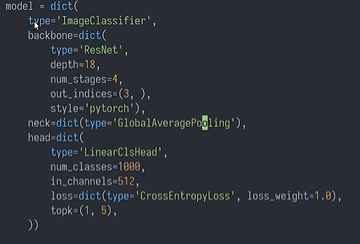
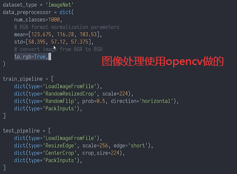
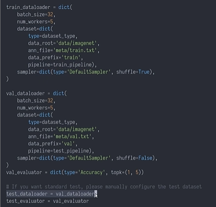
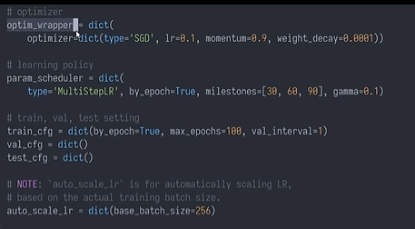
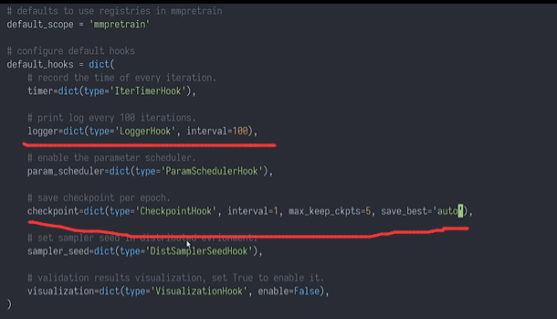
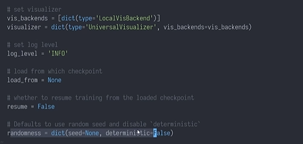

# 第五次课堂笔记-MMPretrain实战

- **由于老师比较硬核全程终端，因此本笔记也大多以命令行展示**

- **安装过程上一次已经讲过，这里就不再赘述**

- **查看mmpretrain都有哪些预训练模型**
  ```python
  from mmpretrain import list_models, get_model, inference_model

  # 比如下面这行代码表示返回所有名称包含resnet18的图像分类任务模型，以此类推替换task和pattern的值即可
  list_models(task = 'Image Classification', pattern = 'resnet18')
  
  # 拿到在对应数据集上预训练的模型
  model = get_model('resnet18_8xb16_cifar10')
  type(model)   # 查看类型
  
  # 使用inference_model进行模型推理，使用预训练权重，第一个参数指定
  inference_model('blip-base_3rdparty_caption', 'demo/cat-dog.jpg', show = True)

  ```

- **训练自己的数据集**
  ```shell
  ls configs  # 查看所有的配置文件，训练时只需修改模型对应的配置文件即可十分方便
  # 由于配置文件中模型的设置是使用字典的形式，所以我们直接指定值即可方便地修改，如：
  from mmengine import Config
  cfg = Config.fromfile('./configs/resnet/resnet18_8xb16_cifar10.py')
  ### 比如这里我们修改模型的分类数量
  cfg.model.head.num_classes = 10
  print(cfg.model)   # 直接修改成功
  ```

- **模型配置部分**



- **数据集配置部分**





- **优化参数配置部分**



- **运行参数配置部分**





- **训练推理过程：如何针对不同的项目配置自己的配置文件**
```python
    """
    首先我们可以mkdir一个文件夹专门存放配置文件
    然后我们可以将mmpretrain/configs下的配置文件的内容复制到我们的文件夹下对应新建的py文件中

    主要修改的内容为自己数据集的路径，还有加载预训练模型权重等
    """
    # 添加预训练权重，在model字典中添加：init_cfg字段
    init_cfg = dict(type='Pretrained', checkpoint='填入openmmlab官方对应权重下载链接')
    # dataset_type修改为自定义类型
    dataset_type = 'CustomDataset'

    # 使用mim命令可以在任意位置开始训练
    mim train mmpretrain "自定义配置文件名称" --work-dir = "指定结果保存路径"

    # 测试
    mim test mmpretrain "自定义配置文件名称" --checkpoint "模型权重路径"
    # 后面再加--out result.pkl可以把预测结果保存下来分析

    # 使用run命令可以分析预测结果
    mim run mmpretrain analyze_results "自定义配置文件名称" result.pkl --out-dir "输出路径"

    # 利用模型推理真实图片
    from mmpretrain import ImageClassificationInferencer
    inferencer = ImageClassificationInferencer('自定义配置文件路径', '模型权重路径')
    inferencer('图片路径', show = True)  # 显示预测结果
```
