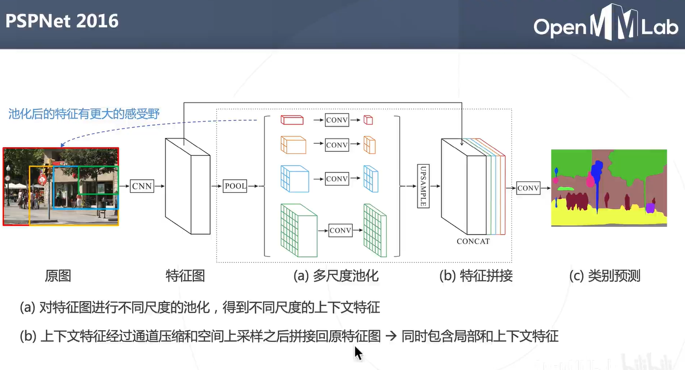

# 第八次课堂笔记-语义分割与MMSegmentation

**课程指路：https://www.bilibili.com/video/BV1gV4y1m74P/**

- **什么是语义分割**

    
    - **应用场景：无人驾驶汽车、人像分割、智能遥感、医疗影像分析**
    - **分割的层级**

    

- **语义分割的基本思路**

    
    
    **上述基于滑动窗口的逐像素分割方法存在计算量大的缺陷，且要确定窗口的大小以及滑动的步长**
    **解决的方案是直接在原图上先卷积，这样只用卷积一次，然后再特征图上滑动，这其实也是RCNN到Fast RCNN的思路**
    
    

    **把全连接层换成卷积层：全卷积网络FCN**
    
    
    

    **Unet：逐级融合高低层次特征**
    

    **利用上下文信息：扩大感受野**
    
    
    
    
    

    **经典算法总结**
    

- **前沿算法**
    - **基本基于transformer**

    
    
    
    

    **SAM（Meta）重量级视觉大模型**
    

- **模型评估**

    