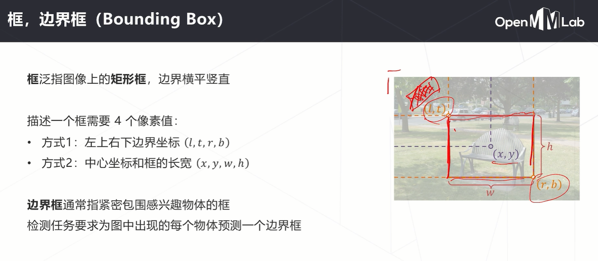

# 第六次课堂笔记-目标检测理论课

- **什么是目标检测**
    
    - 对目标进行定位和分类，数量不固定位置不固定

    
    

- **目标检测的基础知识**

    
    

- **基本思路与改进方法**

    
    
    **改进方法就是直接对全图卷积一次再去特征图上搜索，这其实就是SPPNet的思想**
    
    
    

- **目标检测不仅要分类还要做边界框回归**

    
    
    
    **这里附上之前写的nms代码**
    ```python
    import numpy as np
    def nms(boxes, scores, thresh=0.5):
        # bboxees维度为 [N, 4]，scores维度为 [N, 1]，均为np.array()
        x1 = boxes[:, 0] # 取出所有框的左上角x坐标
        y1 = boxes[:, 1] # 取出所有框的左上角y坐标
        x2 = boxes[:, 2] # 取出所有框的右下角x坐标
        y2 = boxes[:, 3] # 取出所有框的右下角y坐标

        areas = (x2 - x1 + 1) * (y2 - y1 + 1) # 计算所有框的面积，方便后面计算IOU
        order = scores.argsort()[::-1] # 按置信度从大到小排序，返回索引值
        keep = []   # 用于保存框的索引

        while len(order)>0 :
            if len(order) == 1:   # 如果只有一个框，直接保存跳出
                index = order[0]
                keep.append(index)
                break
            else:
                index = order[0]
                keep.append(index)  # 保存置信度最大的框的索引
            
            # 计算置信度最大的框与其他框的IOU
            xx1 = np.maximum(x1[index], x1[order[1:]])   # 这会得到一个交叉区域左上坐标的list，后面同理
            xx2 = np.minimum(x2[index], x2[order[1:]])
            yy1 = np.maximum(y1[index], y1[order[1:]])
            yy2 = np.minimum(y2[index], y2[order[1:]])

            # 计算交叉部分面积
            w = np.maximum(0.0, xx2-xx1+1)
            h = np.maximum(0.0, yy2-yy1+1)

            iou = w*h / (areas[index] + areas[order[1:]] - w*h) # 计算IOU
            
            ind =  np.where(iou<=thresh)[0]   # 小于等于阈值的索引则保留下来
            if len(ind)==0:
                break
            order = order[ind+1]    # 更新order，继续循环
        return keep
    ```
    