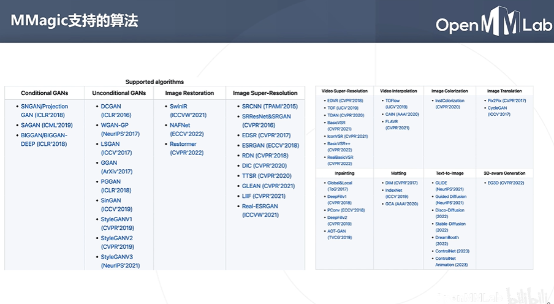
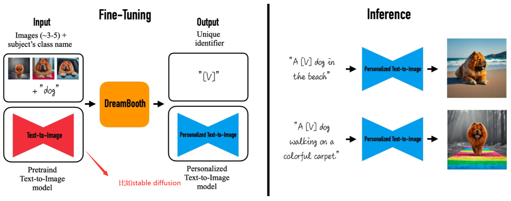
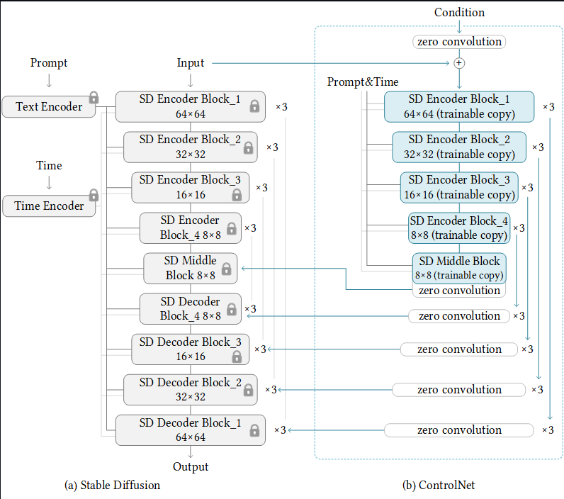
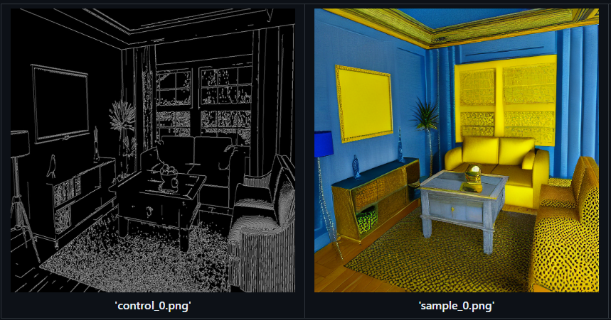
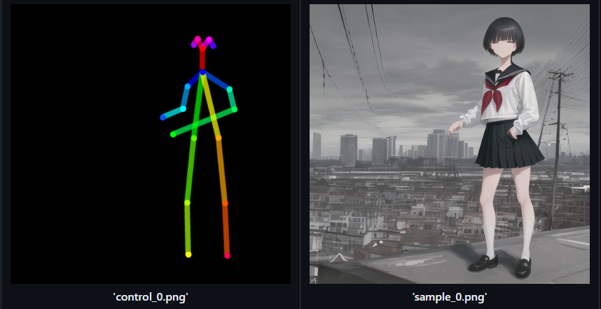

# 第十一次课堂笔记-MMagic AIGC实战

- **代码链接：** https://github.com/TommyZihao/MMagic_Tutorials

- **MMagic支持的算法库**

    

- **文生图的两种大模型**

    - **stable diffusion:** https://github.com/open-mmlab/mmagic/tree/main/configs/stable_diffusion
    
    ```python
    from mmagic.apis import MMagicInferencer
    sd_inferencer = MMagicInferencer(model_name='stable_diffusion')

    text_prompts = 'A panda is having dinner at KFC'
    text_prompts = 'A Persian cat walking in the streets of New York'

    sd_inferencer.infer(text=text_prompts, result_out_dir='output/sd_res.png')
    ```

    - **Dreambooth**
    
    
- **图生图大模型：ControlNet**

    

    **它可以有几种生成方式，比如给一个边缘图生成风格图、给一个姿态图生成人像、还可以生成视频**

    
    

    ```python
    import cv2
    import numpy as np
    import mmcv
    from mmengine import Config
    from PIL import Image

    from mmagic.registry import MODELS
    from mmagic.utils import register_all_modules

    register_all_modules()

    cfg = Config.fromfile('configs/controlnet/controlnet-canny.py')
    controlnet = MODELS.build(cfg.model).cuda()

    prompt = 'Room with blue walls and a yellow ceiling.'
    control_url = 'https://user-images.githubusercontent.com/28132635/230288866-99603172-04cb-47b3-8adb-d1aa532d1d2c.jpg'
    control_img = mmcv.imread(control_url)
    control = cv2.Canny(control_img, 100, 200)
    control = control[:, :, None]
    control = np.concatenate([control] * 3, axis=2)
    control = Image.fromarray(control)

    output_dict = controlnet.infer(prompt, control=control)
    samples = output_dict['samples']
    for idx, sample in enumerate(samples):
        sample.save(f'sample_{idx}.png')
    controls = output_dict['controls']
    for idx, control in enumerate(controls):
        control.save(f'control_{idx}.png')
    ```

    **训练自己的数据集**
    ```shell
    !rm -rf fill50k.zip fill50k
    !wget https://huggingface.co/lllyasviel/ControlNet/blob/main/training/fill50k.zip
    !unzip fill50k.zip >> /dev/null # 解压压缩包
    !rm -rf fill50k.zip # 删除压缩包

    !bash tools/dist_train.sh configs/controlnet/controlnet-1xb1-demo_dataset 1
    ```