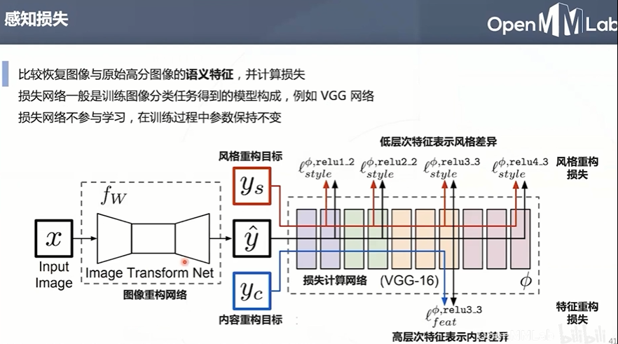

# 第十次课堂笔记-底层视觉与MMEditing

- **什么是超分辨率？根据低分辨率图像重构高分辨率图像**

    
    
    **应用场景：经典游戏的高清重制、动画高清重制、照片修复、节约高清视频的传输带宽、医学影像...**

    

- **图像超分的解决思路**

    **经典方法：**

    
    
    

    **深度学习的到来：end-to-end**

    

    **SRCNN-2014**

    
    
    
    
    
    

    **Fast SRCNN-2016**

    
    
    

- **超分网络常用损失函数**

    
    

- **GAN在图像超分上的应用**

    
    
    
    

    
    

    **Enhanced SRGAN-2018**

    
    

- **视频超分的做法**

    
    
    
    