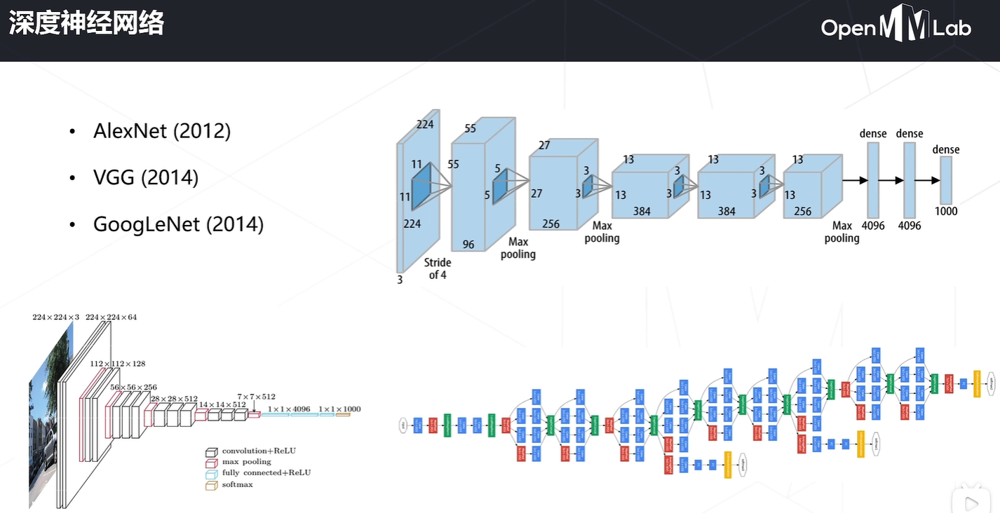

# 第四次课堂笔记-MMPretrain介绍
---

## 1. MMPretrain都包含了哪些算法库？
- 仓库地址为：<herf>https://github.com/open-mmlab/mmpretrain</herf>
- 文档教程为：<herf>https://mmpretrain.readthedocs.io/en/latest</herf>


- 安装步骤如下:（建议采用虚拟环境安装）
  ```shell
  pip install -U openmim
  git clone https://github.com/open-mmlab/mmpretrain.git
  cd mmpretrain
  mim install -e .

  // 如果要是用多模态依赖则添加安装
  mim install -e ".[multimodal]"
  ```

- 配置文件参数：


## 2. 整体代码框架


## 3. 经典骨干网络介绍


- **随着神经网络的发展，人们发现单纯地增加网络的层数似乎并不能使模型的性能更好，反而还更差了，由此he等人引入了残差连接的思想，学习一个恒等变换**


- **Transformer的到来**


    **为什么要引入注意力机制？给不同的区域分配不同的权重，表征了人类注意力的不同，对看到的事物关心程度是不一致的**
    
    

## 4. 什么是自监督学习？

- **不依赖人工标注，而让神经网络自己去学习到一些特征表达**
  


**对比学习的简单思路：**


**MAE：利用掩码学习**


## 5. 多模态模型介绍


